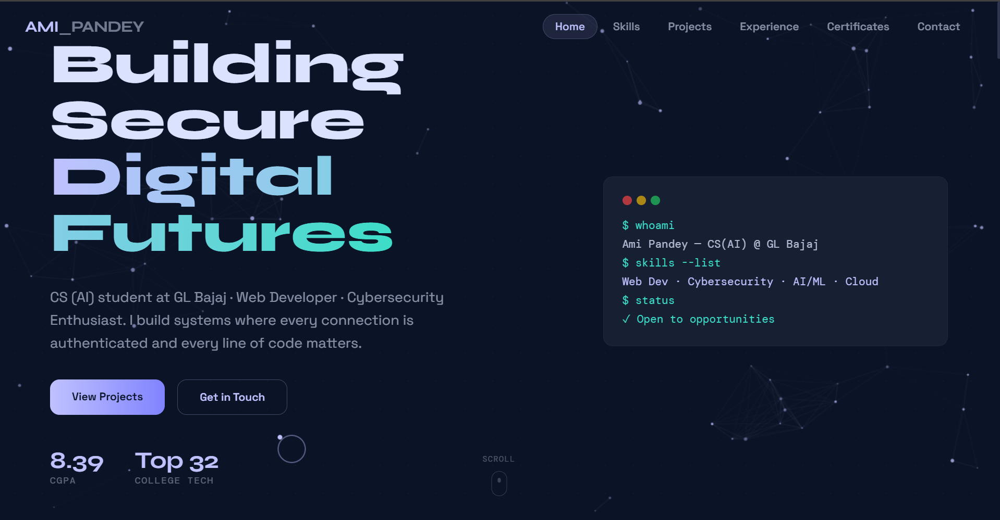
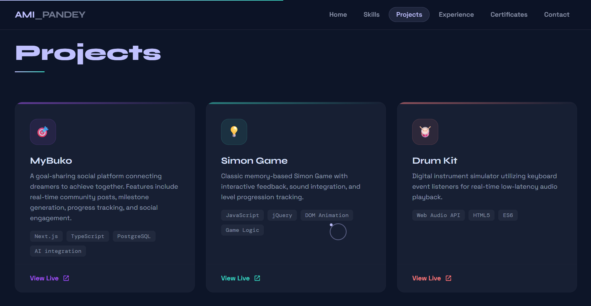

# 🌐 Personal Portfolio — Ami Pandey

[](https://ami01590.github.io/portfolio/)

A fully animated, interactive personal portfolio built to showcase my projects, skills, and journey as a Computer Science Engineering student specializing in AI. Designed with a strong focus on smooth motion design and a modern, polished feel rather than a static template look.

**🔗 Live site:** [ami01590.github.io/portfolio](https://ami01590.github.io/portfolio/)

---

## 📸 Screenshots

<table>
  <tr>
    <td align="center"><b>Landing / Hero Section</b></td>
  </tr>
  <tr>
    <td></td>
  </tr>
  <tr>
    <td align="center"><b>Projects Section</b></td>
  </tr>
  <tr>
    <td></td>
  </tr>
</table>

---

## ✨ Features

This portfolio is built around **seven distinct animation systems**, each chosen to make the site feel alive without sacrificing performance:

- 🧲 **Magnetic Cursor** — Interactive elements subtly pull toward the cursor on hover
- 📊 **Animated Skill Bars** — Skill proficiency bars that fill in on scroll into view
- 🕒 **Timeline Animation** — Smooth, staggered reveal for the experience/education timeline
- 🔤 **Text Scramble Effect** — Headings decode/scramble into place on load
- 📈 **Scroll Progress Indicator** — Visual progress bar tracking scroll position through the page
- 🖼️ **Lightbox** — Expandable project image previews
- 🎬 **Section Reveals** — Scroll-triggered fade/slide-in animations for each section

---

## 🛠️ Tech Stack

| Component | Technology |
| :--- | :--- |
| **Framework** | Vite + React 18 |
| **Animation** | Framer Motion 11 |
| **Styling** | Tailwind CSS |
| **Deployment** | GitHub Pages |

---

## 🚀 Getting Started

### Prerequisites
- **Node.js** (v18 or higher recommended)
- **npm** or **yarn**

### 1. Clone and Install
```bash
git clone https://github.com/AMI01590/portfolio.git
cd portfolio
npm install
```

### 2. Run Locally
```bash
npm run dev
```
The site will be running at [http://localhost:5173](http://localhost:5173) (default Vite port).

### 3. Build for Production
```bash
npm run build
```
This outputs a production-ready build to the `dist/` folder.

### 4. Preview the Production Build Locally
```bash
npm run preview
```

---

## 📬 Connect

- **Portfolio:** [ami01590.github.io/portfolio](https://ami01590.github.io/portfolio/)
- **GitHub:** [@AMI01590](https://github.com/AMI01590)
- **LinkedIn:** [ami-pandey](https://linkedin.com/in/ami-pandey-422604222/)
